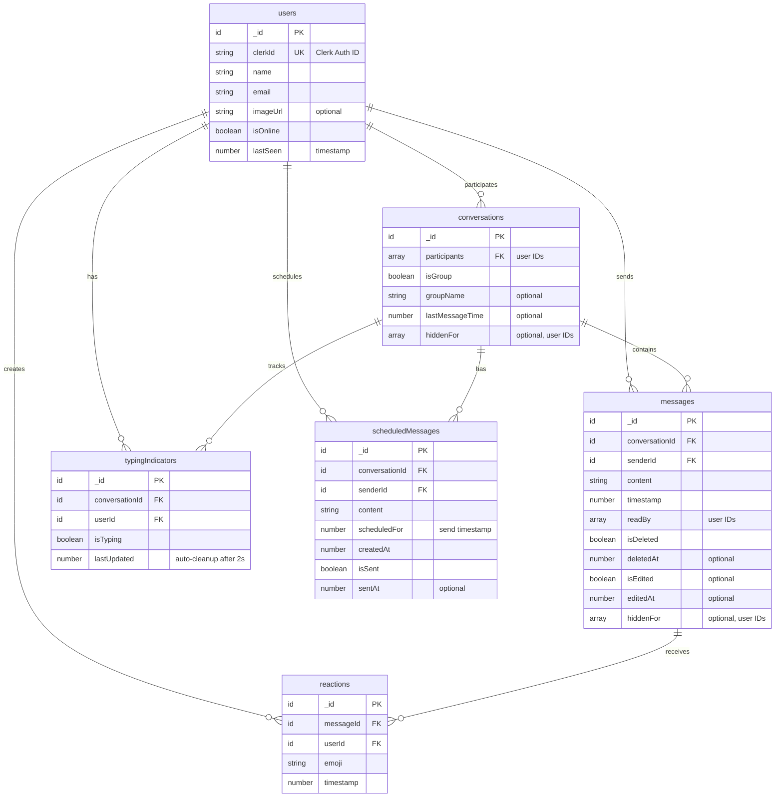

# MyChat Database Schema - ER Diagram

## Entity Relationship Diagram

## Indexes

### users
- `by_clerk_id` on `clerkId` - Fast user lookup from Clerk authentication

### conversations
- `by_last_message` on `lastMessageTime` - Sort conversations by most recent activity

### messages
- `by_conversation` on `conversationId` - Fetch all messages in a conversation
- `by_sender` on `senderId` - Get messages by specific user

### typingIndicators
- `by_conversation` on `conversationId` - Get typing users in a conversation

### reactions
- `by_message` on `messageId` - Get all reactions for a message
- `by_user_and_message` on `userId, messageId` - Toggle user reactions

### scheduledMessages
- `by_scheduled_time` on `scheduledFor` - Process messages by scheduled time
- `by_sender` on `senderId` - Get user's scheduled messages
- `by_conversation` on `conversationId` - Get conversation's scheduled messages

## Relationships

1. **users ↔ conversations**: Many-to-Many
   - Users can participate in multiple conversations
   - Conversations have multiple participants

2. **users → messages**: One-to-Many
   - Each user can send multiple messages
   - Each message has one sender

3. **conversations → messages**: One-to-Many
   - Each conversation contains multiple messages
   - Each message belongs to one conversation

4. **messages → reactions**: One-to-Many
   - Each message can have multiple reactions
   - Each reaction belongs to one message

5. **users → reactions**: One-to-Many
   - Each user can create multiple reactions
   - Each reaction is created by one user

6. **users → typingIndicators**: One-to-Many
   - Each user can have typing indicators in multiple conversations
   - Each typing indicator belongs to one user

7. **conversations → typingIndicators**: One-to-Many
   - Each conversation tracks multiple typing indicators
   - Each typing indicator belongs to one conversation

8. **users → scheduledMessages**: One-to-Many
   - Each user can schedule multiple messages
   - Each scheduled message has one sender

9. **conversations → scheduledMessages**: One-to-Many
   - Each conversation can have multiple scheduled messages
   - Each scheduled message belongs to one conversation

## Key Features

### Soft Delete
- Messages: `isDeleted` flag preserves message history
- Conversations: `hiddenFor` array allows users to hide without deleting

### Read Receipts
- `readBy` array in messages tracks which users have read each message

### Real-time Updates
- `typingIndicators` with `lastUpdated` timestamp for auto-cleanup
- `isOnline` and `lastSeen` for presence tracking

### Message Scheduling
- `scheduledMessages` table with `scheduledFor` timestamp
- `isSent` flag tracks delivery status
